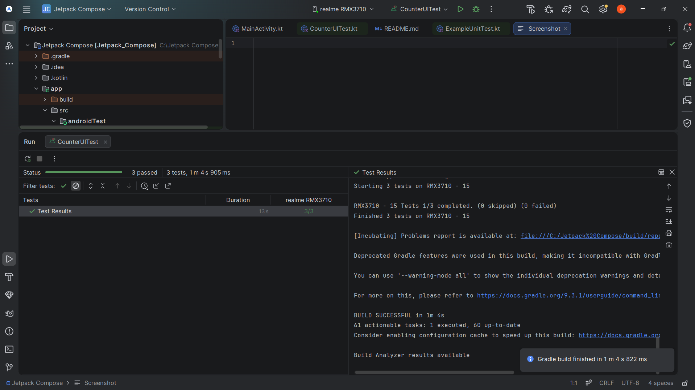
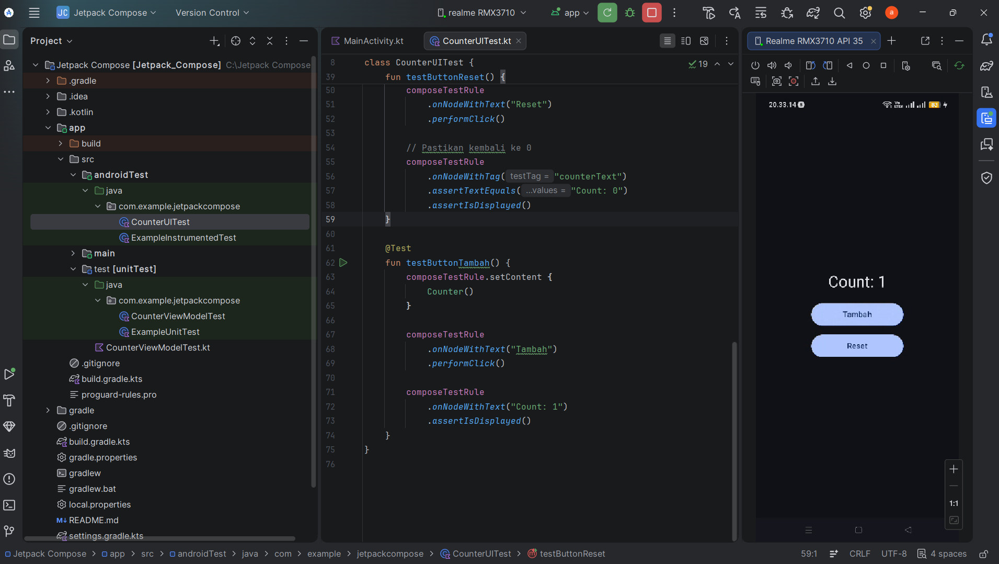
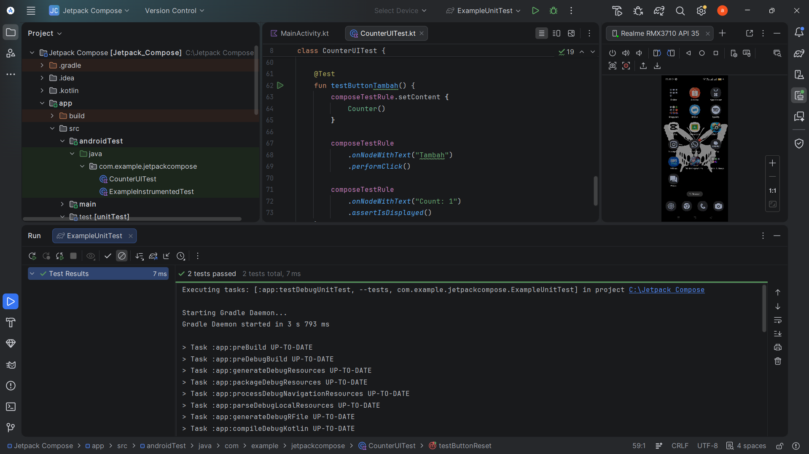

# Pengujian Aplikasi Android dengan Jetpack Compose

## Identitas
Nama: (akhmad amin aziza)  
NIM: (452024611055)  
Kelas: (TI 5 A 1)

---

## Deskripsi
Pengujian dilakukan menggunakan Unit Test (JUnit4) untuk logika dan UI Test (Instrumentation Test) untuk memastikan tampilan berjalan dengan benar.

---

## Struktur Pengujian
- test/ → Unit Test
- androidTest/ → UI Test

---

## Skenario Uji (Buatan Sendiri)
Pengujian dilakukan pada tombol "Tambah".

Langkah:
1. Menampilkan UI Counter
2. Menekan tombol "Tambah"
3. Memastikan nilai berubah dari 0 menjadi 1

Kode:
```kotlin
@Test
fun testButtonTambah() {
    composeTestRule.setContent { Counter() }

    composeTestRule.onNodeWithText("Tambah").performClick()

    composeTestRule.onNodeWithText("Count: 1")
        .assertIsDisplayed()
}
```

---

## Screenshot

### Unit Test


### UI Test


### Aplikasi
